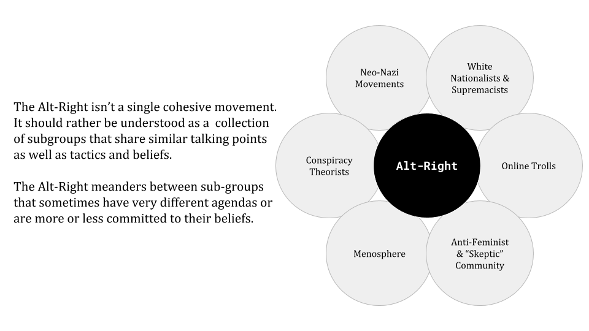
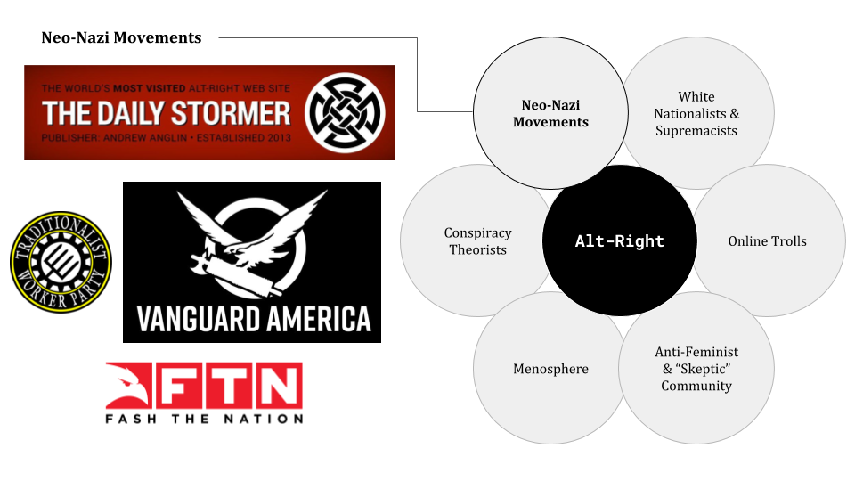
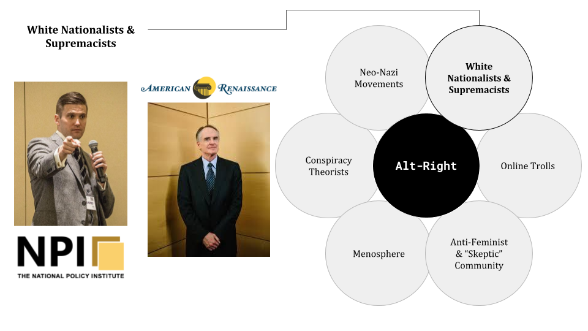
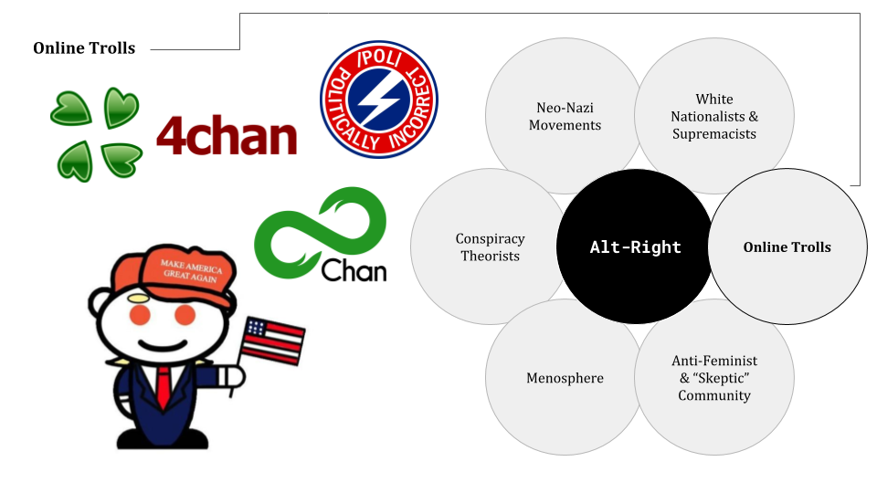
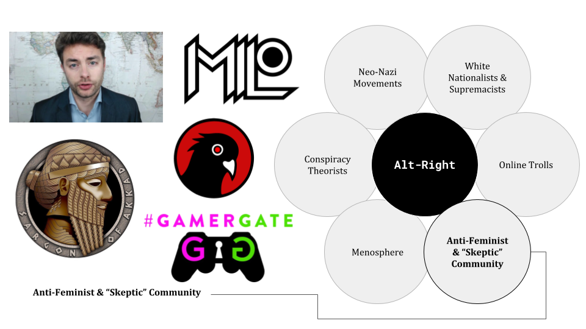
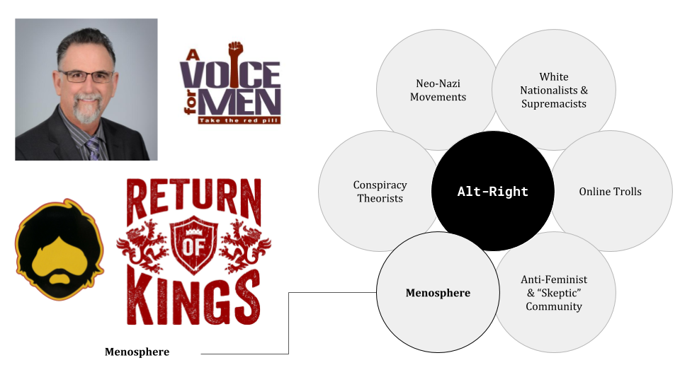
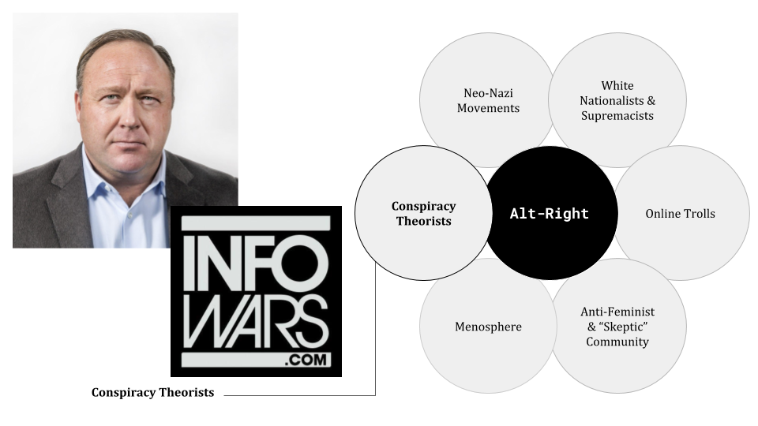
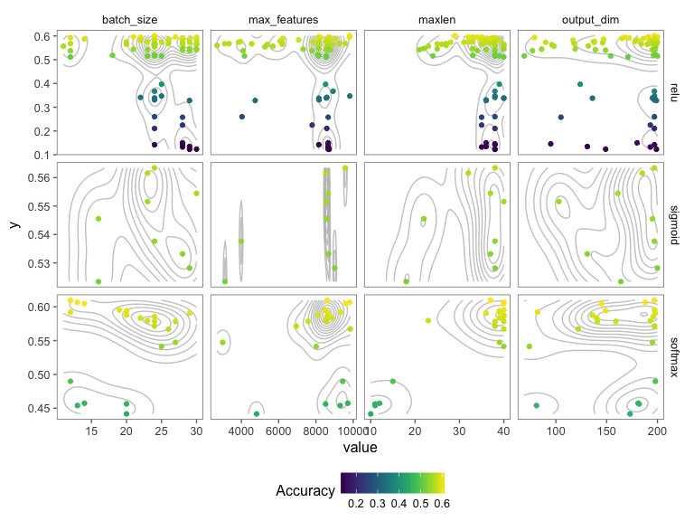

class: center, middle

## What is the Alt-Right?

<style>
.onehundredtwenty {
  font-size: 120%;
   }

<style>
.ninety {
  font-size: 90%;
   }

.eightyfive {
  font-size: 85%;
   }
   
.eighty {
  font-size: 80%;
   }
   
.seventyfive {
  font-size: 75%;
   }
   
.seventy {
  font-size: 70%;
   }
</style>


```{r setup, echo = F, include=F}
# include=FALSE
options(htmltools.dir.version = FALSE)

pacman::p_load(dplyr, ggplot2,  ggthemes, xaringan, tidyTX, viridis, purrr)

knitr::opts_chunk$set(echo = F, warning = F, error = F, message = F)
```


---
class: center, middle

.onehundredtwenty[

**Non-ironic Nazism masquerading as ironic Nazism.**

~Andrew Anglin, Founder of the *The Daily Stormer*

]

---

## What is the Alt-Right?


A group of loosely aligned individuals and subgroups that predominately consist of white, young & male frequent internet user. Although adherence to these beliefs varies, these are some common themes within the Alt-Right:

--

+ Antipathy towards both liberals (*“social justice warriors”*) and conservatives (*“cuckservatives”*) 

--

+ Fighting a *"culture war"* against perceived liberal consensus within the establishment

--

+ Belief that freedom of speech is being threatened by *"political correctness"*

--

+ Strong animosity towards feminism, multiculturalism and immigration (*"cultural marxism"*)

--

+ Belief in biological differences in between races and genders that justifies separate treatment

--

+ Ambiguous and troll-like behavior as to ensure *plausible deniability*


---


<!-- ## What is the Alt-Right? -->

<!-- The Alt-Right consists of... -->

<!-- -- -->

<!-- > an amalgam of conspiracy theorists, techno-libertarians, white nationalists, Men’s Rights advocates, trolls, anti-feminists, anti-immigration activists, and bored young people [...]. [S]ome participants in this ecosystem are organized by their beliefs (like *"Men’s Rights Activists"*), while others are organized by particular media or platforms (such as individual blogs and podcasts). Thus, the lines between these groups are always blurry and uneven (Marwick and Lewis 2017).  -->

<!-- --- -->


## What is the Alt-Right?



---
## What is the Alt-Right?



---
## What is the Alt-Right?



---
## What is the Alt-Right?



---
## What is the Alt-Right?



---
## What is the Alt-Right?



---
## What is the Alt-Right?



---
class: inverse, center, middle

## Data Collection


---

## What data did we collect?

--

+ Text data from three Platforms: Facebook, Twitter and YouTube 

<center>


</center>

--

+ Comments from 36 Alt-Right connected profiles/YouTube channels 

--

+ Comments from 6 Media Outlets (CNN, MSNBC, ABC, Fox News, Washington Post, New York Times)

<center>


</center>

--

+ Comments from the entire year 2017

--

+ In total over 30 million comments/tweets


---

## Who did we scrape? Alt-Right


```{r tally1, echo = F, fig.width = 10, fig.height=7, fig.align="center"}
load("../data/slide_altright_plot.Rdata")

# what about blocked people?

slide_altright_plot %>% 
  ggplot(aes(page, platform, fill = n)) +
  geom_tile() +
  coord_flip() +
  theme_hc() +
  theme(legend.position = "right", text = element_text(size = 20, face = "bold")) +
  viridis::scale_fill_viridis("Number", option = "A", alpha = .7, begin = .2, direction = -1) +
  labs(x = "", y = "") +
  scale_y_discrete(position = "top")
```

---

## Who did we scrape? - Media


```{r tally2, echo = F, fig.width = 10, fig.height=7, fig.align="center"}
load("data/social_media_plot.Rdata")

options(scipen = 999)

social_media_plot %>%
    mutate(page = forcats::fct_recode(page, 
                                    `CNN` = "cnn",
                                    `ABC` = "abc",
                                    `MSNBC` = "msnbc",
                                    `New York Times` = "nyt",
                                    `Washington Post` = "wapo",
                                    `Fox News` = "foxnews"
                                    )) %>% 
  filter(!(page == "ABC" & platform == "YouTube")) %>% 
  filter(!(page == "MSNBC" & platform == "YouTube")) %>% 
  ggplot(aes(page, platform, fill = n)) +
  geom_tile() +
  coord_flip() +
  theme_hc() +
  theme(legend.position = "right", text = element_text(size = 20, face = "bold")) +
  viridis::scale_fill_viridis("Number", option = "A", alpha = .7, begin = .2, direction = -1) +
  labs(x = "", y = "") +
  scale_y_discrete(position = "top")
```


---


class: inverse, center, middle

## Language Modeling: Toxicity

---

### Language Predictions

** Data**

* Cooperation between Wikipedia and Jigsaw
* Five thousand crowd-workers were involved
* Approx. 160k comments annotated with **toxicity** scores
* The dataset is documented [here](https://meta.wikimedia.org/wiki/Research:Detox/Data_Release).

<center>

</center>

**Machine Learning**

* Balanced data to 30.000
* Text Normalization
* Different Keras Models (Accuracy ~90%)
* Prediction scores (*toxicity*) for each comment in the entire corpus 

---

class: inverse, center, middle

## User Activity Types

### How do Media and Alt-Right interact online?


---

## Differentiating between User Activity Types


```{r audience_hist, fig.width = 12, height = 10}
load("../data/audience_hist_dat.Rdata")
load("../data/user_type_count.Rdata")

n_dat <- user_type_count %>% 
  mutate(nn = format(round(nn / 1000000, digits = 2), nsmall = 2) %>% as.character %>% paste0(., "m")) %>% 
  mutate(x = user_type_num %>% as.character  %>% as.numeric) %>% 
  mutate(x = x / 10) %>% 
  select(-user_type_num)

n_dat <- audience_hist_dat %>% 
  mutate(intercepts = round(x, 1)) %>%
  mutate(boundaries = intercepts - .05)  %>%
  mutate(boundaries = ifelse(boundaries < 0, .05, boundaries)) %>%
  group_by(intercepts) %>% 
  summarise(y = max(y) + 0.1) %>% 
  select(y) %>% cbind(n_dat, .)

audience_hist_dat %>% 
  mutate(intercepts = round(x, 1)) %>%
  mutate(boundaries = intercepts - .05)  %>%
  mutate(boundaries = ifelse(boundaries < 0, .05, boundaries)) %>% 
  # mutate(intercepts = ifelse(x > .99, 1, intercepts)) %>% 
  ggplot(aes(x = x, y = y)) +
  geom_line(color = NA) +
  geom_ribbon(aes(x = x, ymax = y, fill = intercepts, group = intercepts), ymin = 0, alpha = 0.3) +
  geom_vline(aes(xintercept = boundaries), linetype = "dashed") +
  #geom_text(data = n_dat, aes(label = nn)) +
  guides(fill = F) +
  viridis::scale_fill_viridis(option = "D", direction = -1) +
  theme_void() +
  labs(x = "\nPercentage of Posts on Alt-Right pages (0% = Media Only; 100% = Alt-Right Only)", y = "Density\n") +
  scale_x_continuous(labels = scales::percent, breaks = seq(0, 1, .1), position = "top", sec.axis = dup_axis()) +
  theme(
        axis.text = element_text(size = 12),
        axis.title = element_text(size = 16),
        axis.ticks.y = element_blank(),
        axis.text.y = element_text(angle = 90), 
        axis.title.x = element_text(margin = margin(b = 25)),
        axis.title.x.bottom = element_blank(),
        axis.title.y = element_text(angle = 90)
        )
```


---

### Shared Active Users: Alt-Right Profiles and Media Outlets

<center></center>


---

### Multilevel Logit Regression:

```{r model1, fig.cap = "Random Intercept (User Audience) and random slope for Altright/Media", fig.width=12, height = 10}
load("../data/model_1_data.Rdata")


pr <- function(log_odds){
  exp(log_odds)/(1+exp(log_odds))
  #log(log_odds)
}


model_1_data %>% 
  #na.omit() %>% 
  group_by(user_type_num, media_typ) %>% 
  dplyr::summarise(
    sdfitted = sd(mfitted, na.rm = T),
    mfitted = mean(mfitted, na.rm = T), 
    n = sum(n),
    nn = n()
  ) %>% 
  ungroup %>% 
  mutate(
    low = (mfitted - 2*sdfitted) %>% pr,
    high = (mfitted + 2*sdfitted) %>% pr
  ) %>% 
  mutate(
    mfitted = pr(mfitted)
    #sdfitted = sdfitted
  ) %>%
  #mutate(user_type_num = factor(user_type_num, levels = c("altright", "mixed", "media"))) %>% 
  mutate(media_typ = ifelse(media_typ == 0, "Media", "Alt-Right") %>% 
        factor(., levels = c("Media", "Alt-Right"))) %>% 
  mutate(user_type_num = as.numeric(user_type_num) / 10 - 0.1) %>% 
  ggplot(aes(user_type_num, mfitted)) +
  geom_ribbon(aes(x = user_type_num, ymin = low, ymax = high), alpha = 0.6, fill = "lightgray") +
  geom_line(aes(as.numeric(user_type_num), mfitted)) +
  geom_point(size = 3.5, alpha = 0.8) +
  scale_x_continuous(labels = scales::percent, breaks = seq(0, 1, .1)) +
  #geom_violin() +
  facet_wrap(~media_typ, ncol = 2) + 
  theme_hc() +
  scale_size_continuous("") +
  # scale_colour_gradientn("Average Toxicity", 
  #                             colours = viridis(256, 
  #                                               alpha = .7,
  #                                               option = "magma",
  #                                               direction = -1)) +
  # viridis::scale_color_viridis("Average Toxicity", option = "A", direction = -1, begin = 0.05, end = 0.7) +
  labs(x = "\nPercentage of Posts on Alt-Right pages (0% = Media Only; 100% = Alt-Right Only)", y = "Predicted Probability: Toxicity\n") +
  theme(panel.spacing = unit(2, "lines"), 
        axis.text = element_text(size = 10),
        axis.title = element_text(size = 16),  
        strip.text = element_text(size = 16),
        legend.position = "bottom",
        legend.key.width = unit(2,"cm"),
        legend.title = element_text(size = 12, face = "bold"),
        plot.title = element_text(size = 20, margin = margin(b = 10))) + 
  guides(
    color = guide_colorbar(order = 1),
    fill = guide_legend(order = 0)
  ) +
  ggtitle("Difference in Toxicity on Media and Alt-Right pages by  User Type")
```

---

background-image: url("../images/toxic_graph.png")
background-position: 50% 50%
background-size: 110%
class: center, top

## The Flow of Toxicity

---

## Average Toxicity by Day

<br>

```{r, fig.height=8, fig.width=14, fig.align="center"}
event_toxic <- function(){
  list(
    geom_vline(xintercept = as.Date("2017-01-21"), linetype = "dashed", color = "darkgrey", size = 0.7), # Trump Inauguration
    #geom_vline(xintercept = as.Date("2017-01-28"), linetype = "dashed", color = "darkgrey", size = 0.7), # Trump Muslim Ban
    geom_vline(xintercept = as.Date("2017-02-02"), linetype = "dashed", color = "darkgrey", size = 0.7), # Berkeley Riot Milo
    geom_vline(xintercept = as.Date("2017-03-23"), linetype = "dashed", color = "darkgrey", size = 0.7), # Westminster
    # geom_vline(xintercept = as.Date("2017-04-07"), linetype = "dashed", color = "darkgrey"), # Syria strikes
    geom_vline(xintercept = as.Date("2017-05-23"), linetype = "dashed", color = "darkgrey", size = 0.7), # Manchaster concert bombing
    # geom_vline(xintercept = as.Date("2017-06-04"), linetype = "dashed", color = "darkgrey", size = 0.7), # London Bridge
    geom_vline(xintercept = as.Date("2017-06-11"), linetype = "dashed", color = "darkgrey", size = 0.7), # Sharia March
    # geom_vline(xintercept = as.Date("2017-07-06"), linetype = "dashed", color = "darkgrey", size = 0.7), # Charlottesville
    geom_vline(xintercept = as.Date("2017-08-13"), linetype = "dashed", color = "darkgrey", size = 0.7), # Charlottesville
    # geom_vline(xintercept = as.Date("2017-08-17"), linetype = "dashed", color = "darkgrey"), # Barcelona
    geom_vline(xintercept = as.Date("2017-11-01"), linetype = "dashed", color = "darkgrey", size = 0.7), # NY Truck Attack
    geom_vline(xintercept = as.Date("2017-11-29"), linetype = "dashed", color = "darkgrey", size = 0.7) # Trump retweet
    # geom_vline(xintercept = as.Date("2017-12-15"), linetype = "dashed", color = "darkgrey"), # Net Neutrality
    # geom_vline(xintercept = as.Date("2017-12-06"), linetype = "dashed", color = "darkgrey"), # NY Truck Attack
    # geom_vline(xintercept = as.Date("2017-12-18"), linetype = "dashed", color = "darkgrey"), # Twitterpurge
  )
}

load("../data/toxic_timeline.Rdata")

pal <- viridis::viridis_pal(option = "B", begin = 0, end = 1, direction = -1)(10)

top <- .445
mid <- .430
low <- .415

key_dates <- tibble(
     cdate = c(
               as.Date("2017-01-21"), 
               # as.Date("2017-01-28"), 
               as.Date("2017-02-02"),
               as.Date("2017-03-23"),
               as.Date("2017-05-23"),
               # as.Date("2017-06-04"),
               as.Date("2017-06-11"),
               as.Date("2017-08-13"),
               as.Date("2017-11-01"),
               as.Date("2017-11-29")
               ),
    event = c(
               "Trump Inaug.", 
               # "Muslim Ban",
               "Berkeley Riots",
               "Westminster", 
               "Manchester",
               # "London Bridge",
               "March A. Sharia",
               "Charlottesville",
               "New York",
               "Britain First Retweet"
               ),
    toxic = c(top, 
              #mid, 
              low, mid, top, 
              # mid, 
              low, mid, top, low
              #.4, .4, .4, .4,. 4
              ))


toxic_timeline %>%
  mutate(type = ifelse(type == "media", "Media", "Alt-Right")) %>% 
  ggplot(aes( x = cdate, y = toxic)) +
  event_toxic() +
  geom_line(aes(color = type), size = 1.4, alpha = .7) + 
  theme_hc() +
  labs(y = "Average Toxicity\n", x = "") +
  scale_x_date(date_labels = "%b", date_breaks  = "1 months")  +
  geom_text(data = key_dates, aes(label = event), angle = 0, vjust = 1.5, size = 5.2, fontface = "bold") +
  geom_point(data = key_dates, size = 4) +
  scale_color_manual("Type", values = c("red", "blue")) +
  # ylim(0, 80000) +
  # guides(color = F, text = F)  +
  theme(legend.position = "bottom", 
        axis.text = element_text(size = 15),
        axis.title = element_text(size = 17),
        # legend.key.width = unit(2,"cm"),
        legend.key.height = unit(2,"cm"),
        legend.title = element_text(size = 15, face = "bold", hjust = 0.5),
        legend.text = element_text(size = 15)
        ) +
  xlim(as.Date("2017-01-01"), as.Date("2017-12-31"))


```

---
background-image: url("../images/year_toxic.gif")
background-position: 50% 50%
background-size: 110%
class: center, top

## The Flow of Toxicity over time

---

class: inverse, center, middle

## Content Analysis

---

### Multilevel Logit Regression: 

```{r model3, fig.cap = "Random Intercept (User Audience) and random slope for Racial Mentionings", fig.width=12, height = 10}
load("../data/model_2_data.Rdata")
pr <- function(log_odds){
  exp(log_odds)/(1+exp(log_odds))
  #log(log_odds)
}

model_2_data %>% 
  #na.omit() %>% 
  group_by(user_type_num, keyword, count) %>% 
  dplyr::summarise(
    sdfitted = sd(mfitted, na.rm = T),
    mfitted = mean(mfitted, na.rm = T), 
    n = sum(n),
    nn = n()
  ) %>% 
  ungroup %>% 
  mutate(
    low = (mfitted - 2*sdfitted) %>% pr,
    high = (mfitted + 2*sdfitted) %>% pr
  ) %>% 
  mutate(
    mfitted = pr(mfitted)
    #sdfitted = sdfitted
  ) %>%
  mutate(keyword = forcats::fct_recode(keyword, 
      Immigrants = "immigrant",
      Jews = "jews",
      `Black People` = "black",
      Muslims = "muslim"
    )
  ) %>% 
  mutate(keyword = factor(keyword,
                          levels = c("Immigrants",
                                     "Jews",
                                     "Black People",
                                     "Muslims"))) %>%
  # mutate(mfitted = mfitted %>% as.numeric)
  mutate(user_type_num = as.numeric(user_type_num)/10) %>% 
  ggplot(aes(user_type_num, mfitted, group = as.factor(count))) +
  geom_ribbon(aes(x = user_type_num, ymin = low, ymax = high), 
              alpha = 0.6, fill = "lightgray") +
  geom_point(size = 2, alpha = 0.7, aes(colour = as.factor(count))) +
  geom_line() +
  facet_wrap(~keyword, ncol = 4) +
  theme_hc()  +
  scale_x_continuous(labels = scales::percent, breaks = seq(0, 1, .25), limits = c(0,1)) +
  scale_colour_manual("Keyword", values = c("blue", "red"), labels = c("not present", "present")) + 
  labs(x = "\nPercentage of Posts on Alt-Right pages (0% = Media Only; 100% = Alt-Right Only)", y = "Predicted Probability: Toxicity\n") +
theme(panel.spacing = unit(2, "lines"), 
        axis.text = element_text(size = 10),
        axis.title = element_text(size = 16),  
        strip.text = element_text(size = 16),
        legend.position = "top",
        legend.key.width = unit(2,"cm"),
        legend.title = element_text(size = 12, face = "bold"),
        plot.title = element_text(size = 20, margin = margin(b = 10))) + 
  guides(
    # color = guide_colorbar(order = 1),
    fill = guide_legend(order = 0)
  ) +
  ggtitle("Difference in Toxicity by User Type and Keywords")
  
```


---

### Most Frequent Bigram Network - Muslims

<center>  </center>

---

class: inverse, center, middle

## Conclusions

---


## Conclusions

* Alt-Right pages exhibit much greater levels of toxicity than Media equivalents

--

+ Alt-Right toxicity spikes on days of major Terror attacks and events like "March Against Sharia" or Charlottesville

--

+ There is a good share of users that comment both on Alt-Right and Media pages

--

+ *Alex Jones* and *Paul Joseph Watson* share a considerable user base with each other as well as with *Fox News* and *CNN*
  
--

+ Highest levels of toxicity on Media pages are from polarized Alt-Right users

--

+ On Alt-Right pages, polarized Media users are almost as toxic as Alt-Right users 

--

+ Polarized Alt-Right users use much more toxic language when talking about Immigrants, Black people and Muslims

---

class: inverse, center, middle


## Thanks for Listening!

Slides: <a href='decoding-the-altright.netlify.com'>https://decoding-the-altright.netlify.com/ </a>


---

## References

Hawley, G. (2017). Making Sense of the Alt-right. Columbia University Press.

Marwick, A., & Lewis, R. (2017). Media manipulation and disinformation online. New York: Data & Society Research Institute.


---

class: inverse, center, middle

## Appendix


---

.eightyfive[

**Milo Yiannopolous' characterization of the Alt-Right:** $^1$

> *The alt-right is a movement born out of the youthful, subversive, **underground edges of the internet**. 4chan and 8chan are hubs of alt-right activity. For years, members of these forums – political and non-political – have delighted in **attention-grabbing, juvenile pranks**. Long before the alt-right, 4channers turned **trolling** the national media into an in-house sport.*

**Marwick and Lewis 2017**

> *Term coined by Richard Spencer to describe a version of **white nationalism** that positions itself as comprised of **younger, wealthier, and better-educated individuals** than traditional white supremacist groups like the Klu Klux Klan. Deeply entwined with social media and staples of **internet culture, like memes**. Believes that **“political correctness” threatens individual liberty**. Example: Jared Taylor of the American Renaissance, Mike Cernovich of Danger and Play.*

**Hawley 2017**

> *Using the loosest definition, we could say the Alt-Right includes anyone with right-wing sensibilities that **rejects the mainstream conservative movement**. But there are certain common, perhaps universal attitudes within the Alt-Right. The Alt-Right is **fundamentally concerned with race**. At its core, the Alt-Right is a white-nationalist movement, even if many (perhaps most) of the people who identify with the Alt-Right do not care for that term. The most energetic and significant figures of the movement want to see the creation of a **white ethnostate** in North America.*

]

.seventy[

$^1$Allum Bokhari and Milo Yiannopoulos, “An Establishment Conservative’s Guide to the Alt-Right,”
Breitbart, March 29, 2016, http://www.breitbart.com/tech/2016/03/29/an-establishment-conservatives-guide-to-the-alt-right/.

]

---

### Appendix: Total Number of Posts and Comments: Alt-Right

<br>

```{r, fig.height=8, fig.width=14, fig.align="center"}
event_terror <- function(){
  list(
    geom_vline(xintercept = as.Date("2017-01-20"), linetype = "dashed", color = "black"), # Trump Inauguration
    # geom_vline(xintercept = as.Date("2017-01-27"), linetype = "dashed", color = "black"), # Trump Muslim Ban
    geom_vline(xintercept = as.Date("2017-02-01"), linetype = "dashed", color = "black"), # Berkeley Riot Milo
    geom_vline(xintercept = as.Date("2017-03-22"), linetype = "dashed", color = "black"), # Westminster
    geom_vline(xintercept = as.Date("2017-04-07"), linetype = "dashed", color = "black"), # Syria strikes
    geom_vline(xintercept = as.Date("2017-05-22"), linetype = "dashed", color = "black"), # Manchaster concert bombing
    # geom_vline(xintercept = as.Date("2017-06-03"), linetype = "dashed", color = "black"), # London Bridge
    geom_vline(xintercept = as.Date("2017-08-17"), linetype = "dashed", color = "black"), # Barcelona
    geom_vline(xintercept = as.Date("2017-11-01"), linetype = "dashed", color = "black"), # NY Truck Attack
    geom_vline(xintercept = as.Date("2017-11-29"), linetype = "dashed", color = "black"), # Trump retweet
    # geom_vline(xintercept = as.Date("2017-12-15"), linetype = "dashed", color = "black"), # Net Neutrality
    # geom_vline(xintercept = as.Date("2017-12-06"), linetype = "dashed", color = "black"), # NY Truck Attack
    geom_vline(xintercept = as.Date("2017-12-18"), linetype = "dashed", color = "black") # Twitterpurge
  )
}

key_dates <- tibble(
     cdate = c(as.Date("2017-01-20"), 
               as.Date("2017-02-01"), 
               as.Date("2017-03-22"),
               as.Date("2017-04-07"),
               as.Date("2017-05-22"),
               as.Date("2017-08-17"),
               as.Date("2017-11-01"),
               as.Date("2017-11-29"),
               as.Date("2017-12-18")),
    event = c("Trump Inaug.", 
               "Berkeley Riots", 
               "Westminster",
               "Syria Strikes", 
               "Manchester",
               "Barcelona",
               "New York",
               "Britain First Retweet",
               "'Twitterpurge'"),
    n = c(70000, 70000, 70000, 70000, 70000, 70000, 70000, 14000, 70000),
    terror = c(0, 0, 1, 0, 1, 1, 1, 0, 0) %>% as.character)
              
          
load("../data/total_posts.Rdata")
# save(total_posts, file = )
total_posts %>% 
  ggplot(aes(cdate, n)) +
  event_terror() +
  geom_line(size = 1.4, alpha = .7) +
  geom_point(data = key_dates, size = 2) +
  theme_hc() +
  labs(y = "Total Number of Comments and Tweets\n", x = "") +
  scale_x_date(date_labels = "%b", date_breaks  ="1 months")  +
  theme(axis.text = element_text(size = 15),
        axis.title = element_text(size = 16)) +
  geom_text(data = key_dates, aes(label = event, color = terror), angle = 90, vjust = 1.5, size = 6.3) +
  scale_color_manual("", values = c("black", "red")) +
  ylim(0, 80000) +
  guides(color = F, text = F)

# ggsave(filename = "images/timeline_all.png", width = 12, height = 6)
```


---

### Appendix: Text Predictions

<!-- * different keras models: very complex, millions of parameters and several deep non-linear layers.  -->
<!-- * global metrics help to understand system performance -->

```{r, fig.cap="Model Performances", fig.width=13}
library(tidyverse)

load("../data/model_perform.Rdata")
model_perform %>% 
  rename(Accuracy = acc, F1 = f1) %>%
  tidyr::gather(metric, value, -models) %>% 
  ggplot(aes(models, value, fill = metric)) + 
  geom_bar(stat = "identity", position = position_dodge()) +
  scale_fill_grey("") +
  theme_classic() +
  labs(x = "", y = "") +
  scale_y_continuous(breaks = seq(0, 1, by = .1)) +
  coord_flip()
```

---

### Appendix: Explainability I

<!-- * Trusting your algorithemn is crusical for adoption, documentation, regulatory oversight and human acceptance. -->
<!-- * How to? Zoom into individual instances of your data or your predictions and derive local explanations.  -->
<!-- * open black box algorithms -->
<!-- * assessing local interpretation of predictions. -->
<!-- * our examples -->
<!-- * compare classifier -->

```{r}
load("../data/text_predictions.Rdata")

viz_text <- function(dd){
  
  col <- viridis::viridis(5, alpha = .5, option = "magma", begin = .1, end = .7,  direction = -1)
  tocix_colors <- c(rep("white", 5), col)
  #plot(rep(1,10),col=tocix_colors, pch=19,cex=2)
  # colfunc1 <- colorRampPalette(c("white", "white", "#e63900"))
  colfunc2 <- colorRampPalette(c("black", "black", "gray10"))
  #colfunc1 <- colorRampPalette(c("black", "gray80", "#e63900"))
  # sent_colors <- colfunc1(10)
  text_colors <- colfunc2(10)
  # colfunc2 <- colorRampPalette(c("white", "#00cc44"))
  # #sent_colors <- c(colfunc1(6)[-6], colfunc2(6)[-1])
  # sent_colors <- c(colfunc1(5)[-5], colfunc2(5)[-1])
  # #sent_colors <- c(colfunc1(6)[-6], colfunc2(6)[-1])
  # plot(rep(1,10),col=sent_colors, pch=19,cex=2)
  
  # get_sent_color <- function(x){
  #   index <- (x*10) %>% 
  #     round
  #   sent_colors[index]
  # }
  
  
  get_toxic_color <- function(x){
    index <- (x*10) %>% 
      round
    tocix_colors[index]
  }
  
  get_text_color <- function(x){
    index <- (x*10) %>% 
      round
    text_colors[index]
  }
  
  library(shiny)
  dd %>% 
    split(1:nrow(.)) %>% 
    map(~{
      span(
        style= paste0("background-color:", get_toxic_color(.x$prob), "; color: ", get_text_color(.x$prob)), paste0(.x$word, " ")
      )
    }) %>% 
    p(.)
}


text_predictions[[1]][[2]] %>% 
  viz_text

text_predictions[[2]][[2]] %>% 
  viz_text

text_predictions[[3]][[2]] %>% 
  viz_text

text_predictions[[4]][[2]] %>% 
  viz_text
```

---

### Appendix: Explainability II

<!-- * open black box algorithms -->
<!-- * assessing local interpretation of predictions. -->
<!-- * our examples -->
<!-- * compare classifier -->


```{r}
load("../data/com_list.Rdata")

viz_comp <- function(tab_data){
    col <- viridis::viridis(5, alpha = .5, option = "magma", begin = .1, end = .7,  direction = -1)
  tocix_colors <- c(rep("white", 5), col)
  #plot(rep(1,10),col=tocix_colors, pch=19,cex=2)
  # colfunc1 <- colorRampPalette(c("white", "white", "#e63900"))
  colfunc2 <- colorRampPalette(c("black", "black", "gray10"))
  #colfunc1 <- colorRampPalette(c("black", "gray80", "#e63900"))
  # sent_colors <- colfunc1(10)
  text_colors <- colfunc2(10)
  # colfunc2 <- colorRampPalette(c("white", "#00cc44"))
  # #sent_colors <- c(colfunc1(6)[-6], colfunc2(6)[-1])
  # sent_colors <- c(colfunc1(5)[-5], colfunc2(5)[-1])
  # #sent_colors <- c(colfunc1(6)[-6], colfunc2(6)[-1])
  # plot(rep(1,10),col=sent_colors, pch=19,cex=2)
  
  # get_sent_color <- function(x){
  #   index <- (x*10) %>% 
  #     round
  #   sent_colors[index]
  # }
  
  
  get_toxic_color <- function(x){
    index <- (x*10) %>% 
      round
    tocix_colors[index]
  }
  
  get_text_color <- function(x){
    index <- (x*10) %>% 
      round
    text_colors[index]
  }
  
  tagList(
    HTML("<center>"),
    shiny::tags$table(id = "tab1", style = 'font-size: 14px',
      class="ui compact table",
      shiny::tags$thead(
        shiny::tags$tr(
          colnames(tab_data) %>% 
            map(~{
              shiny::tags$th(.x)
            })
        ) 
      ),
      shiny::tags$tbody(
        tab_data %>% 
          split(1:nrow(.)) %>%
          map(~{
            shiny::tags$tr(
              .x %>% 
                unlist %>% 
                map(~{
                  shiny::tags$th(
                    if(!is.na(as.numeric(.x))){
                      div(
                        style = paste0("background-color:", get_toxic_color(as.numeric(.x))), 
                        .x
                      )   
                    } else {
                      .x
                    }
                  )
                })
            )
          })
      )
    ),
    HTML("</center>")
  )
}

com_list[[2]][[2]] %>% 
  viz_comp
```

<!-- <center> -->
<!--  -->
<!-- </center> -->

---

### Appendix: Nullmodel


```{r model0, fig.cap = "Random Intercept (User Audience)", fig.width=12, height = 10}
load("../data/null_data.Rdata")

pal <- viridis::viridis_pal(option = "B", begin = 0, end = 1, direction = -1)(10)

pr <- function(log_odds){
  exp(log_odds)/(1+exp(log_odds))
  #log(log_odds)
}

null_data %>% 
  group_by(user_type_num) %>% 
  dplyr::summarise(
    sdfitted = sd(mfitted, na.rm = T),
    mfitted = mean(mfitted, na.rm = T), 
    n = sum(n),
    nn = n()
  ) %>% 
  ungroup %>% 
  mutate(
    low = (mfitted - 2*sdfitted) %>% pr,
    high = (mfitted + 2*sdfitted) %>% pr
  ) %>% 
  mutate(
    mfitted = pr(mfitted)
    #sdfitted = sdfitted
  ) %>%
  mutate(user_type_num = as.numeric(user_type_num) / 10 - 0.1) %>% 
  #mutate(user_type_num = factor(user_type_num, levels = c("altright", "mixed", "media"))) %>% 
  # mutate(media_typ = ifelse(media_typ == 0, "Media", "Altright") %>% 
  #       factor(., levels = c("Media", "Altright"))) %>% 
  ggplot(aes(user_type_num, mfitted)) +
  geom_line(aes(as.numeric(user_type_num), mfitted)) +
  geom_ribbon(aes(x = user_type_num, ymin = low, ymax = high), alpha = 0.6, fill = "lightgray") +
  geom_point(size = 3.5) +
  scale_x_continuous(labels = scales::percent, breaks = seq(0, 1, .1)) +
  #geom_violin() 
  # viridis::scale_color_viridis("Average Toxicity", option = "A", direction = -1, begin = 0.05, end = 0.7) +
  labs(x = "\nPercentage of Posts on Alt-Right pages (0% = Media Only; 100% = Alt-Right Only)", y = "Predicted Probability: Toxicity\n") +
  #facet_wrap(~media_typ, ncol = 2) + 
  theme_hc() +
  scale_size_continuous("") +
  theme(legend.position = "bottom", 
        axis.text = element_text(size = 12),
        axis.title = element_text(size = 16),
        legend.key.width = unit(2,"cm"),
        legend.title = element_text(size = 12, face = "bold", hjust = 0.5),
        legend.title.align = c(3),
        plot.title = element_text(size = 20, margin = margin(b = 10))
        ) + 
  guides(
    color = guide_colorbar(order = 1),
    fill = guide_legend(order = 0)
  ) +
  ggtitle("Difference in Toxicity by User Type")
  # +
  # scale_colour_gradientn("Average Toxicity", 
  #                             colours = viridis(256, 
  #                                               alpha = .7,
  #                                               option = "magma",
  #                                               direction = -1)) +
```

---

#### Appendix: Most Frequent Bigram Network - Jews

<center>  </center>

---

#### Appendix: Most Frequent Bigram Network - Migrants

<center>  </center>
